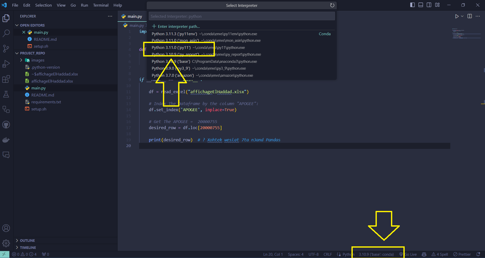
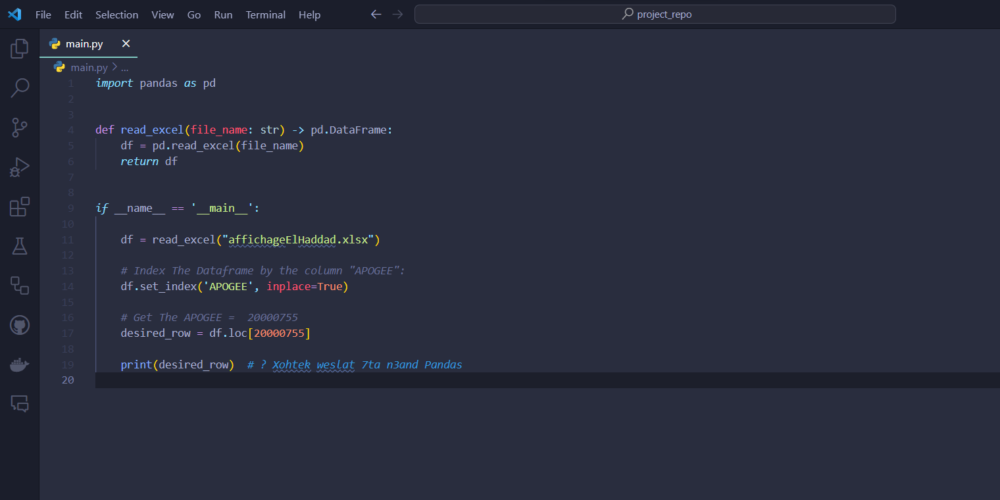
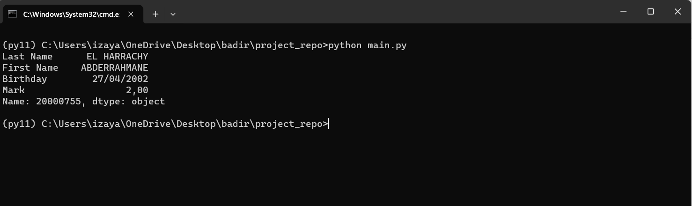

# How To Set Up Python environment:

### All the commands to set up the environment are in the file: `setup.sh`

### To activate the conda environment on VSCode:

<h1 align="center">
  
   
</h1>

<h1 align="center">
  
   
</h1>

<h1 align="center">
  
   
</h1>
